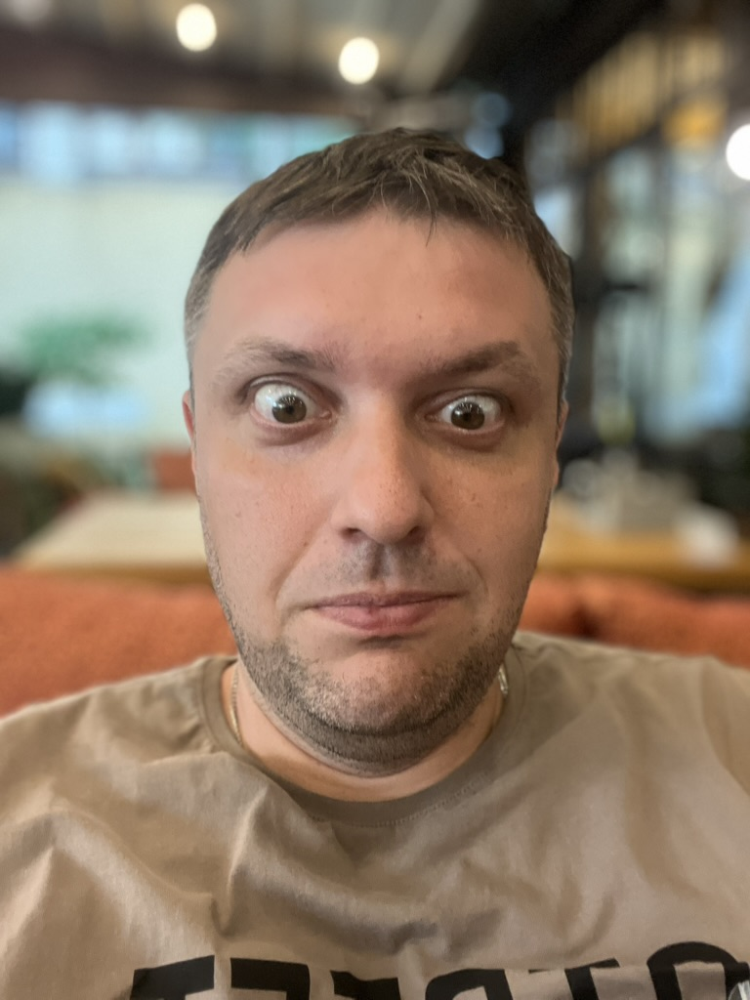

# Overview

Привет, меня зовут Андрей

Я занимаюсь IT; подумал, что некоторые мысли уже стоит выпустить из головы, а то их становится слишком много 🙂

Большую часть жизни занимался продажей своего времени за деньги (коммерческая разработка ПО), в последние несколько лет еще и преподаванием программирования.

Контент не на что не претендует: любые упоминания являются только частным мнением, одобрения не ожидаю, но возможно что-то кому-то будет интересно. Любые оскорбления игнорирую; если кого-то случайно оскорбил — заранее прошу прощения.

Внимание: данный репозиторий и его содержимое публикуются как личные заметки и мнения автора. Ни при каких обстоятельствах автор не несёт ответственности и не даёт согласия на привлечение к ответственности читателей, организаций или третьих лиц в связи с упоминаниями, идеями или примерами, содержащимися в этом проекте.

Ссылки где меня можно найти:

1. [https://github.com/haiodo](https://github.com/haiodo)

2. @dev_haiodo

## Резюме

Тут будет мое полное резюме того чего я делал про то что смогу рассказать, но в процессе все еще :-)

## Daily Blob posts

- [2025-10-24](./daily/008_2025_oct_24.md)
- [2025-10-21](./daily/007_2025_oct_21.md)
- [2025-10-20](./daily/006_2025_oct_20.md)
- [2025-10-17](./daily/005_2025_oct_17.md)
- [2025-10-16](./daily/004_2025_oct_16.md)
- [2025-10-15](./daily/003_2025_oct_15.md)
- [2025-10-14](./daily/002_2025_oct_14.md)
- [2025-10-13](./daily/001_2025_oct_13.md)

## Dev posts

- [001 - Huly Mermaid diagrams](./posts/001_mermaid/001_mermaid.md) [English](./posts/001_mermaid/001_mermaid_english.md)
