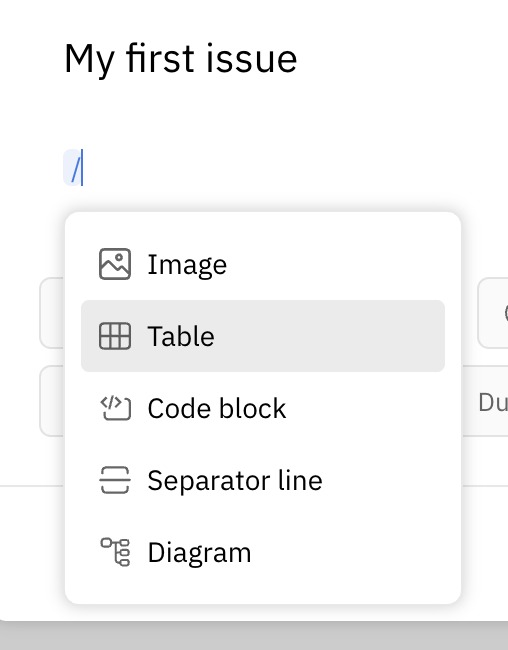
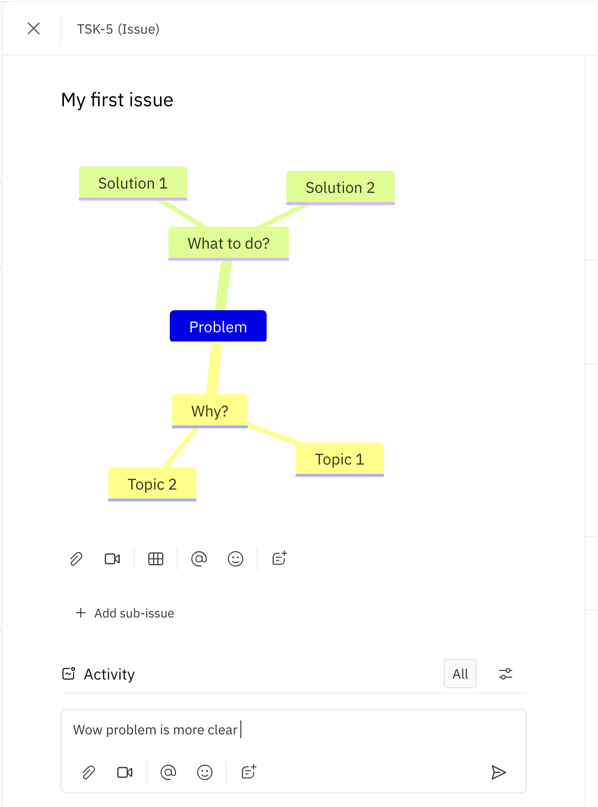
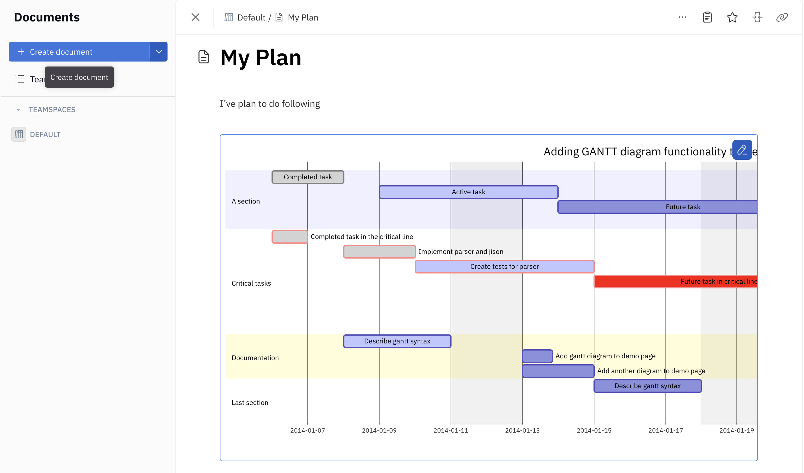

# Простые диаграммы

А вы знали что в Huly интегрирована поддержка создания простых и не только простых диаграмм? Это мощный инструмент визуализации, который помогает командам лучше понимать, планировать и документировать свои проекты прямо внутри платформы.

На текущий момент в Huly поддерживаются **Mermaid диаграммы** — один из самых популярных и гибких инструментов для создания диаграмм. С помощью Mermaid можно создавать:

- **Flowcharts** (блок-схемы) для отображения логики процессов
- **Sequence diagrams** (диаграммы последовательности) для документирования взаимодействия компонентов
- **Gantt charts** (диаграммы Ганта) для планирования проектов
- **Mindmaps** (интеллект-карты) для мозгового штурма
- **Class diagrams** (диаграммы классов) для архитектуры систем
- **State diagrams** (диаграммы состояний) и многое другое!

Большое спасибо проекту [Mermaid.js](https://mermaid.js.org) за превосходный инструмент, хотя в будущем также могут быть добавлены и другие форматы диаграмм.

Мы благодарны сообществу Open Source за то, что оно позволяет встраивать одни Open Source решения в другие продукты. В результате мы как пользователи получаем значительно более широкие и мощные возможности, не нужно переходить между разными приложениями.

## Как добавить диаграмму к Issue Tracker?

Диалог создания новой Issue позволяет выбрать добавление в Description новой диаграммы в формате Mermaid. Это очень удобно, когда нужно быстро визуализировать проблему прямо при создании задачи. Давайте посмотрим как это работает.


После нажатия на `/` на клавиатуре появляется диалог добавления различных вставок (slash commands). Выбираем опцию "Диаграмма" из списка доступных элементов.



После вставки шаблона диаграммы вы получаете полный доступ ко всем возможностям Mermaid. Поддерживается последняя официальная версия библиотеки, так что все новые и мощные возможности всегда под рукой. Например, давайте нарисуем mindmap — отличный способ структурировать идеи и подзадачи.


После создания задачи диаграмма становится доступной всей команде. Очень удобно, что можно добавить несколько диаграмм одновременно в одну Issue, комбинируя разные типы диаграмм для лучшей наглядности.



Например, давайте добавим в задачу диаграмму Ганта, чтобы показать как мы планируем решать возникшую проблему и распланировать этапы работы. Это помогает команде четко понимать временные рамки и зависимости между подзадачами.


## Более широкие планы

Если нам нужно более масштабное планирование с лучшей визуализацией, это не проблема. Модуль документов Huly (Documents), а также модуль карточек (Cards), который сейчас находится в активной разработке, также полностью поддерживают встраивание диаграмм в контент.



Преимущество работы с диаграммами в документах — это возможность просмотра на широком экране, лучший контекст, а также возможность легко поделиться своими планами с кем-то еще, будь то коллега, менеджер или клиент. Диаграммы отлично помогают донести информацию без лишних слов.

## А что же другие модули?

Даже модуль для найма сотрудников не остается в стороне! Диаграммы могут быть очень полезны при работе с вакансиями и портретом идеального кандидата. Давайте добавим диаграмму в описание вакансии.

Например, у нас есть возможность визуально представить портрет "Супер Инженера" с указанием всех необходимых скилов, которые нам могут понадобиться. Это помогает не только рекрутерам, но и самим кандидатам лучше понять требования должности.


Поддерживаются абсолютно все возможности Mermaid. Мы, например, можем устанавливать размеры диаграммы при отображении такие, какие нам нужны — хоть мелко, хоть крупно. Это дает полную свободу в оформлении и позволяет адаптировать визуализацию под конкретные задачи.

```markdown
---
config:
  radar:
    width: 200
    height: 200
title: 'Needs'
---
```

## Еще один момент — совместное редактирование в реальном времени

Это, пожалуй, самая интересная и уникальная фишка! Все редакторы в Huly построены на основе коллаборационной технологии **y.js** и **CRDT** (Conflict-free Replicated Data Type). Это означает, что все редактирование происходит в режиме реального времени с полной синхронизацией между участниками.

В результате, мы получаем один из очень немногих редакторов в мире, в котором несколько человек одновременно могут создавать и редактировать Mermaid диаграммы в соавторстве! Это невероятно удобно для командной работы:

- **Живое сотрудничество**: видите в реальном времени, как коллеги вносят изменения
- **Решение конфликтов**: CRDT автоматически разрешает конфликты редактирования
- **Нет потери данных**: все изменения сохраняются и синхронизируются
- **История версий**: можно отследить кто и когда внес изменения


Это открывает совершенно новые возможности для дистанционных команд и мозговых штурмов прямо внутри Huly!
