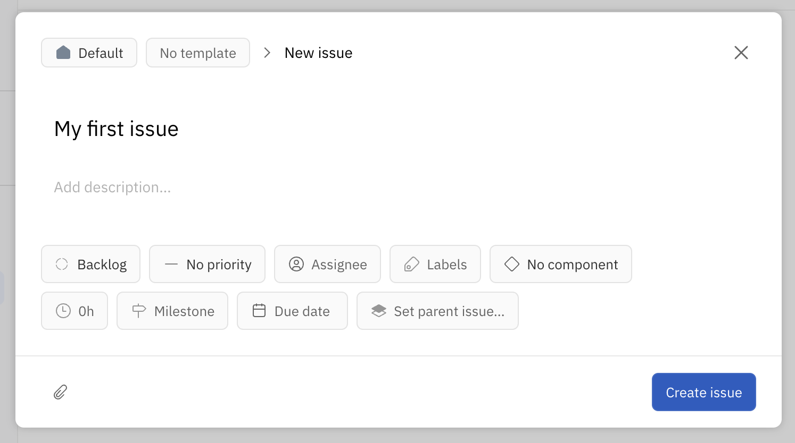
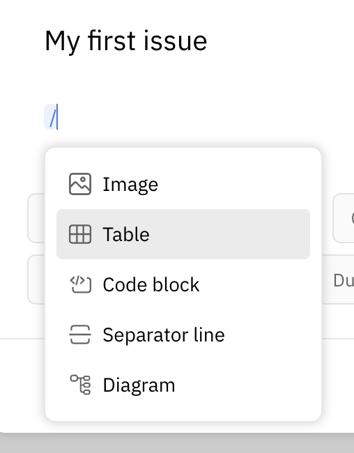
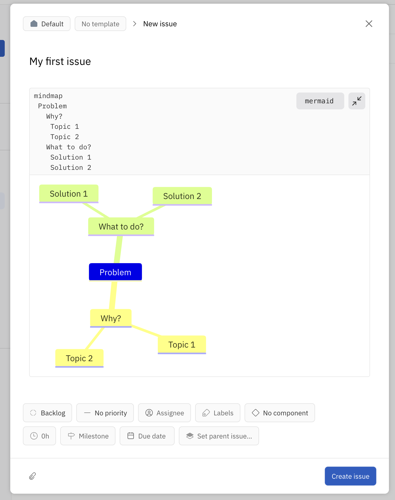
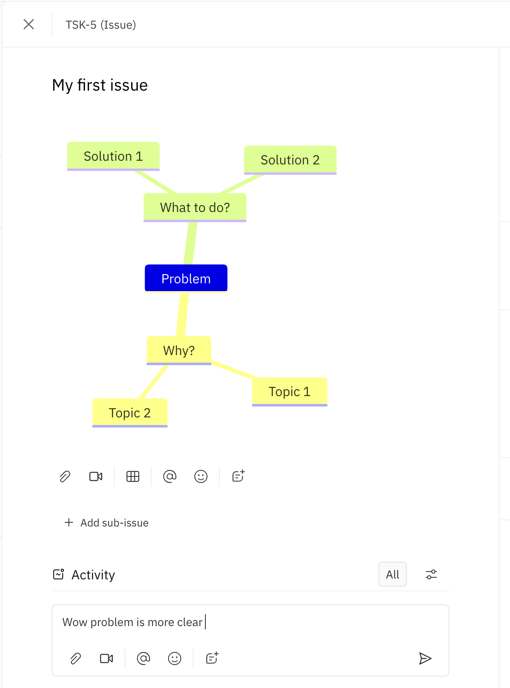
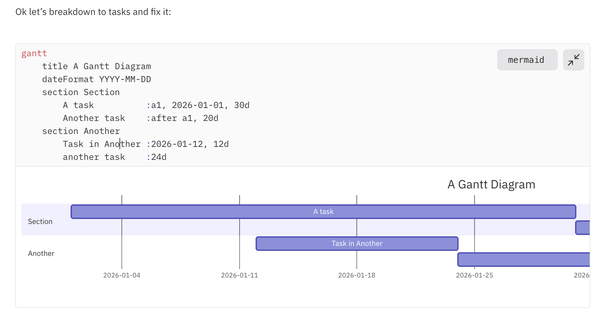
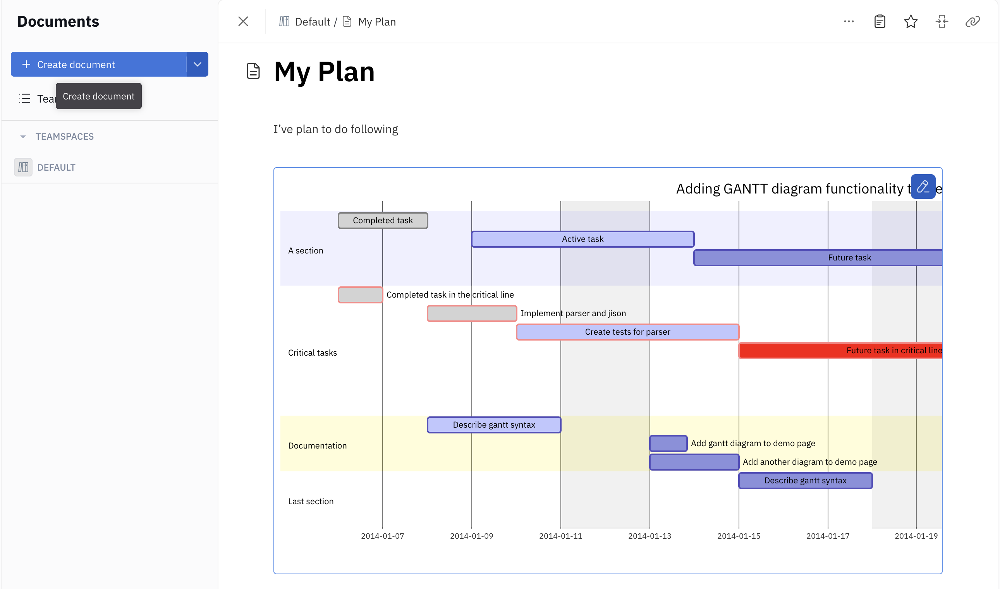
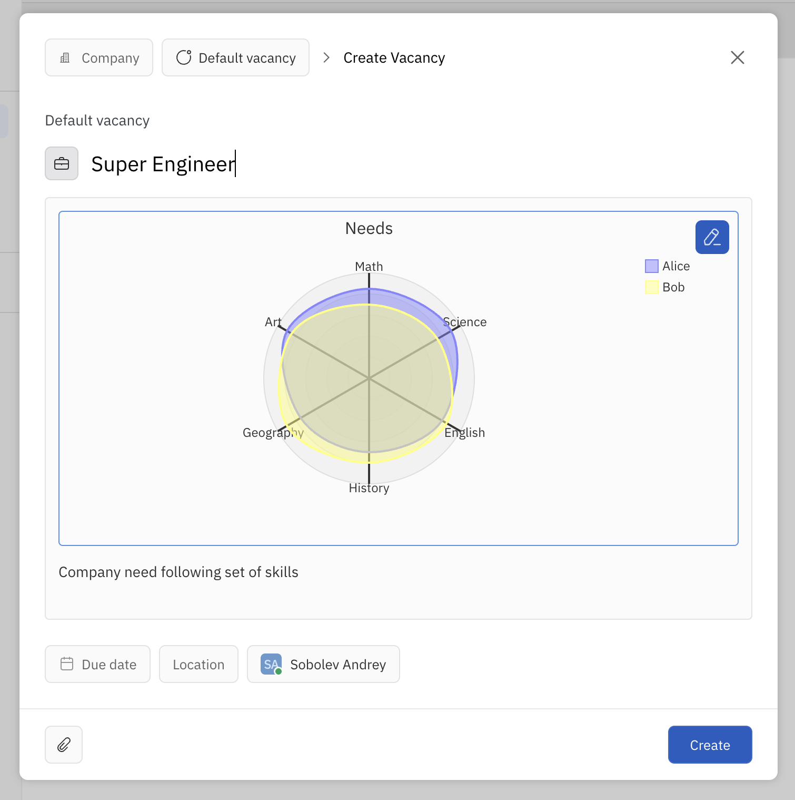

# Simple Diagrams

Did you know that Huly has integrated support for creating simple and not-so-simple diagrams? It's a powerful visualization tool that helps teams better understand, plan, and document their projects right within the platform.

Currently, Huly supports **Mermaid diagrams** — one of the most popular and flexible diagram creation tools available. With Mermaid, you can create:

- **Flowcharts** for visualizing process logic
- **Sequence diagrams** for documenting component interactions
- **Gantt charts** for project planning and scheduling
- **Mindmaps** for brainstorming and ideation
- **Class diagrams** for system architecture
- **State diagrams** and much more!

Special thanks to the [Mermaid.js](https://mermaid.js.org) project for this excellent tool, although other diagram formats may be added in the future as well.

We're grateful to the Open Source community for making it possible to embed one Open Source solution into other products. As a result, users like us get significantly broader and more powerful capabilities, without needing to jump between different applications.

## How to Add a Diagram to Issue Tracker?

The issue creation dialog allows you to add a new diagram in Mermaid format to the Description. This is very convenient when you need to quickly visualize a problem right when creating a task. Let's see how it works.



After pressing `/` on the keyboard, a dialog for adding various insertions (slash commands) appears. Select the "Diagram" option from the list of available elements.



After inserting the diagram template, you get full access to all Mermaid capabilities. The latest official version of the library is supported, so all new and powerful features are always at your fingertips. For example, let's draw a mindmap — an excellent way to structure ideas and subtasks.



After creating the task, the diagram becomes available to your entire team. It's very convenient that you can add multiple diagrams at once in one Issue, combining different diagram types for better clarity.



For example, let's add a Gantt chart to show how we plan to solve the problem and outline the work stages. This helps the team clearly understand the timeline and dependencies between subtasks.



## Broader Planning

If we need larger-scale planning with better visualization, that's no problem. Huly's Documents module, as well as the Cards module currently in active development, also fully support embedding diagrams in content.



The advantage of working with diagrams in documents is the ability to view on a wide screen, better context, and the ability to easily share your plans with someone else, whether it's a colleague, manager, or client. Diagrams help convey information without unnecessary words.

## What About Other Modules?

Even the employee recruitment module isn't left out! Diagrams can be very useful when working with job postings and defining the ideal candidate profile. Let's add a diagram to a job vacancy description.

For example, we have the opportunity to visually represent the profile of a "Super Engineer" with all the necessary skills we might need. This helps not only recruiters but also candidates themselves better understand the job requirements.



Absolutely all Mermaid capabilities are supported. We can, for example, set the diagram sizes for display exactly as we need them — whether small or large. This provides complete freedom in formatting and allows us to adapt the visualization to specific tasks.

```markdown
---
config:
  radar:
    width: 200
    height: 200
title: 'Needs'
---
```

## One More Thing — Real-Time Collaborative Editing

This is perhaps the most interesting and unique feature! All editors in Huly are built on the collaborative technology **y.js** and **CRDT** (Conflict-free Replicated Data Type). This means that all editing happens in real-time with full synchronization between participants.

As a result, we get one of the very few editors in the world where multiple people can simultaneously create and edit Mermaid diagrams collaboratively! This is incredibly convenient for team work:

- **Live collaboration**: see in real-time as colleagues make changes
- **Conflict resolution**: CRDT automatically resolves editing conflicts
- **No data loss**: all changes are saved and synchronized
- **Version history**: you can track who made changes and when


This opens up completely new possibilities for remote teams and brainstorming sessions right within Huly!
