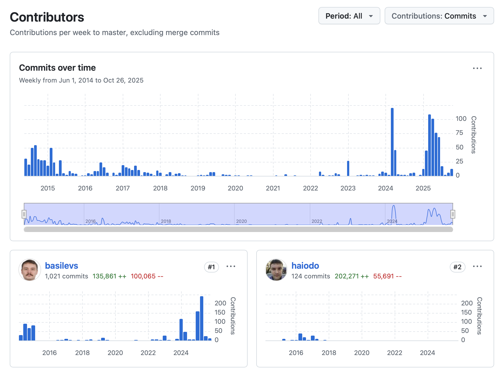

# 🔹 28 Октября 2013

28 Октября в моей жизни, не всегда было интересным, но в 2013 году я был в Германии, на Eclipse Summit Europe.

Тогда мы активно делали Q7 [RCPTT](https://eclipse.dev/rcptt/) - и на [Github](https://github.com/eclipse-rcptt/org.eclipse.rcptt)

Если честно Германия/Штудгард мне не понравилась, было много графити, грязно, много мусора вокруг, но местами.

Но около отеля где проходила конференция было достаточно неплохо. Чистенько, и приятненько. Город контрастов.

Были вместе с Иваном Иноземцевым, @komazz было клево. В один момент вечером пошли купить пожрать, было реально страшно :-)

RCPTT - это продукт для тестирования приложений на основе Eclipse платформы, идея в том что там на языке достаточно высокого уровня, который мы придумали (ECL-Eclipse Command Language), можно было записывать автоматом и выполнять UI тесты. В ручную можно было даже реализовать BrainFuck что один из пользователей в итоге и сделал :-)

Интересных идей там много, до сих пор мало кто приблизился, даже в PlayWright хоть и хорошо уже, но не настолько насколько было удобно тестировать приложения для Eclipse.

Все было основано на AspectJ инструментации Eclipse как платформы, залезли везде где только можно, чтобы знать в какой момент мы можем исполнять следующий шаг теста.

Без всяких wait, без всякой химии, мы как и пользователь знали когда что делать. + Куча всяких триков чтобы тесты выполнялись быстро. + У нас был сервер который выполнял тесты параллельно, на куче реальных виндовых или виртуальных машинок.

Он сейчас тоже в open-source [RCPTT-Server] (https://github.com/eclipse-rcptt/rcptt-server)

Что интересно я все еще номер 2 в репозитории но уже на Github, понятно дело там часть истории потеряна напрочь :-)

