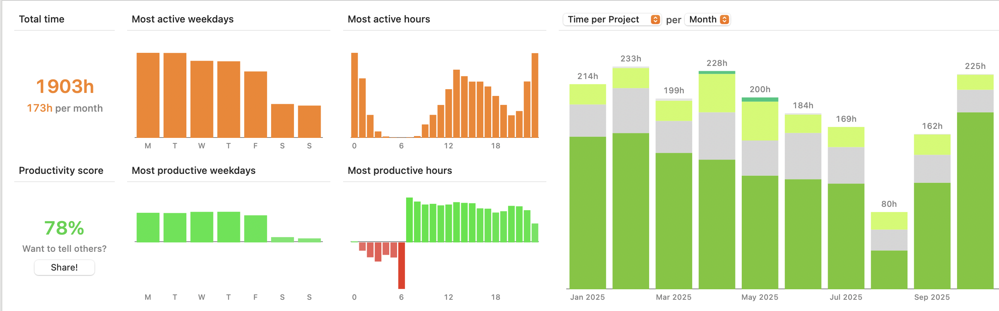

# Overview

Думал очеденой план на ближайшие пару месяцев, а может и дольше, как пойдет.

Как всегда в последнее время, обдумывание разных тем лучше проходит с хождением по улице, иду куда то, а голова продолжает думать, и перебирать разные варианты. Сегодя результаты размышлений были где то на 13767 шагов, которые намерил мой телефон :-)

Смотрите план на текущий момент, для того чтобы была возможность, не отвлекаясь делать интересные вещи, для меня или для тех кто меня заинтересует, нужно некоторое внешнее финансирование.

Я планирую часть времени тратить на свое развитие, изучение новых тем, технологий и направлений. Часть времени буду писать мемуары за последние 20 лет моей работы и учебы, остальное время буду делать новую тему, о ней сообщу чуть позже как сформируется до конца. Остальное время я могу посвятить чему то интересному что предложите вы.

На boosty.to я выставил уровни подписки, каждый значить, или разовую целевую работу, или минимально число часов которое я буду тратить в месяц на вешу тему, подписки от 5 до 20 часов в месяц на вашу тему, если тема мне будет мне симпотизировать или будет ОЧЕНЬ интересна -> то буду тратить больше, если нет, то после нескольких итераций, я вам об этом скажу, и вы или предложите другую тему или мы разойдемся в разные стороны.
Если темы которые вы предложите будут закрытыми, и будет просто требоваться моя помощь, то любые публикации будут с вашего одобрения.

Если схема зайдет и будет и меня и вас радовать, то можно продоллжать сколько угодно долго :-) Если нет, то через пару месяцев я планирую начать или искать подработку, или предложу продукты которые будет интересно попользовать. Про них я буду рассказывать в приватной части блога, за минимальную подписку, а тут буду только интриговать вас небольшими подробностями, конечно там может быть как пшик так и вау-вау, но тут уже как жизнь пойдет.

Почему я не пойду и просто не устроюсь на работу как все нормальные людй?

Ну большу часть жизни я так и проработал, правда я работал всего в нескольких местах, и в последнем последние 20 лет, хочется побыть в какой то другой роли.

Возможно раскрыть себя в других направлениях, возможно помочь тем кому не мог бы помочь в другом случае, возможно качественный софт, который я обычно делал, придется вам по вкусу. Чем я могу это горонтировать, ну продукты которые я делал всегда как минимум радовали заказчиков, последний проект Huly хоть мы и разошлись с моем прошлым работодателем, во мнениях относительно всего, и я категорически не захотел быть, "кожаным" сотрудником, набрал 23 тысячи звездочек на Github. Можете посмотреть тут: https://www.youtube.com/watch?v=GfnueD7jEzw если кто не видел.

Прошлые не-были так извенестны, но например DLTK(официальный эклипсовый проект, на нем фирма Zend делала свой PHP на основе Eclipse).
Или RCPTT- это система для автоматического тестирования Eclipse приложений, вообще появилась из моей идеи сделать нормально работающий Tool для тестирования, бала востребована и тд, но так как я пахал безбожно, чтобы сделать эти проекты офигенно, а другие люди на этом пиарились все это вылелось в итоге в то что, об меня вытерли ноги в очередной раз, и это стало последней каплей, что даже не захотелось продолжать с тем же Huly, Xored, Hardcoreeng, HulyLabs и иже с ними. У всего есть цена, у всего есть забвение, но я думаю мое время еще не закончилось и я могу сделать еще много чего интересного, и ваше участие может мне в этом помочь.

Если у вас есть тема которая вам интересна но у вас не когда небыло на нее времени, напишите мне, подпишитесь на boosty, и мы вместе доведем и мои и ваши идеи до рабочих решений.

