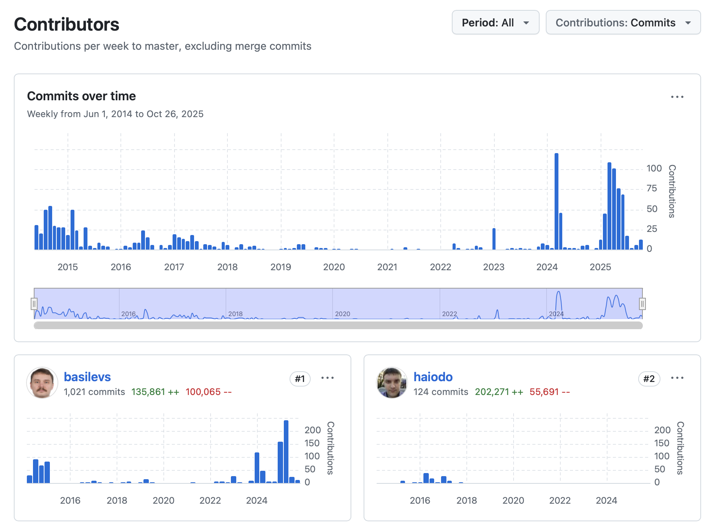

import { Icon } from 'astro-icon/components';
import { Image } from 'astro:assets';

### 28 Октября в моей жизни, не всегда было интересным, но в 2013 году я был в Германии, на Eclipse Summit Europe.

Тогда мы активно делали Q7, который в последствии стал официальным Eclipse проектом под именем [RCPTT](https://eclipse.dev/rcptt/) - и на [Github](https://github.com/eclipse-rcptt/org.eclipse.rcptt)

Если честно Германия/Штудгард мне не совсем понравилась, было много граффити, грязно, много мусора вокруг, но местами.
Но около отеля где проходила конференция было достаточно неплохо. Чистенько, и прекрасно. Город контрастов.

Были вместе с Иваном Иноземцевым, @komazz было клево. В один момент вечером пошли купить пожрать, было реально страшно :-)

RCPTT - это продукт для тестирования приложений на основе Eclipse платформы, идея в том что там на языке достаточно высокого уровня, который мы придумали
(ECL -> Eclipse Command Language),
можно было записывать автоматом и выполнять UI тесты.

В ручную можно было даже реализовать BrainFuck интерпретатор, что один из пользователей в итоге и сделал :-)

Интересных идей там много, до сих пор мало кто приблизился, даже в PlayWright, хоть и хорошо уже, но не настолько насколько было удобно тестировать приложения для Eclipse.

Все было основано на AspectJ инструментации Eclipse, как платформы, залезли везде где только можно, а где нельзя тоже залезли, чтобы знать в какой момент мы можем исполнять следующий шаг теста. Идея простая, понять когда бы пользователь нажал на что то, и нажать в тот самый момент когда уже точно можно.

Без всяких wait, без всякой логики проверок (аля "химии"). + Куча всяких трюков, чтобы тесты выполнялись реально быстро, пользователь с такой скорость не когда не сможет тыкать. + У нас был сервер который выполнял тесты параллельно, на куче реальных или виртуальных машинках.

Как то даже посчитали что для выполнения всех тестов для одно из продуктов ручную, тесты выполнялись несколько часов, нужно реально несколько месяцев в ручную тыкать в приложение, чтобы проверить все возможные сценарии. И это на каждый коммит происходило, так что от автоматического тестирования в том числе и UI, большая выгода для проекта, особенно, если он маленький.

Была история от одного из наших клиентов, что они наняли студента на part-time, и он покрыл все их приложение тестами за несколько недель, и это было для них вау-вау.

Совместно с RCPTT и сервер тоже тоже сейчас в open-source [RCPTT-Server](https://github.com/eclipse-rcptt/rcptt-server), он как раз и позволяет разпаралелить исполнение тестов на несколько машинок, задание на тестирование отправляется серверу и он уже распределяет нагрузку на сервере, это был мой один из первых проектов, где пришлось активно попользовать сетевое программирование. Было интересно.

Что интересно я все еще номер 2 в репозитории но уже на Github, понятно дело там часть истории потеряна напрочь :-)




## Пример сценария на языке ECL

```tcl
get-menu "File/New/Java Project" | click
with [get-window "New Java Project"] {
    get-editbox -after [get-label "Project name:"] | set-text sample
    get-button Finish | click
}
get-view "Package Explorer" | get-tree | get-item "sample/src"
    | get-property childCount | equals 0 | verify-true
```
